# 🌌 AetherFlow

> Orchestrating the Next Era of Bare-Metal Infrastructure.

AetherFlow is a modern, enterprise-grade bare-metal orchestration platform. Rebuilt from the ground up to replace legacy bloat with mathematical precision, AetherFlow delivers unparalleled performance, security, and AI-driven automation for managing media-server applications.

Powered by a high-performance **Go (Gin)** control plane, a **strictly-typed React (Next.js)** frontend, and native **systemd** orchestration—AetherFlow is built for the edge.

---

## 📚 Documentation Portal

Welcome to the AetherFlow v3.1.x documentation suite. Whether you are deploying your first node or building against the Marketplace API, everything you need is here.

### Start Here
- **[About AetherFlow](./docs/about.md)** — The history, from QuickBox to v3, and our core platform philosophy.
- **[System Architecture](./docs/architecture.md)** — High-level design, Go/Next.js stack, and systemd mechanics.
- **[Quickstart Guide](./docs/quickstart.md)** — The shortest path to deploying a fresh Ubuntu 24.04 node.

### Operations & Security
- **[Configuration Reference](./docs/configuration.md)** — Complete `SQLite`/`Redis` and `.env` parameter guide.
- **[Security & Hardening](./docs/security.md)** — Deep dive into TOTP 2FA, AES-256-GCM encryption, and sudoers policies.
- **[Upgrading & Rollbacks](./docs/upgrading.md)** — How to migrate from PM2 to systemd or roll back bad updates.

### Platform Features
- **[FlowAI Assistant](./docs/flowai.md)** — The AI operations layer, Support vs. Assistant modes, and the Action Approval Gate.
- **[AetherMarketplace](./docs/marketplace.md)** — Overview of the 50+ managed applications, installation loops, and data retention.
- **[Marketplace Developer Guide](./docs/marketplace-developer-guide.md)** — Technical requirements for creating idempotent `common.sh` installer scripts.

### Reference & Troubleshooting
- **[API Documentation](./docs/api.md)** — Complete REST endpoint structures, WebSocket sub-protocols, and CSRF rules.
- **[Testing AetherFlow](./docs/testing.md)** — How to run Playwright E2E suites, backend Go tests, and manual python diagnostics.
- **[Troubleshooting & FAQ](./docs/troubleshooting.md)** — Resolving "System Offline" errors, connection drops, and marketplace script failures.

---

## ✨ Core Directives

We did not adopt complexity for the sake of it. AetherFlow is built on a rigid philosophy: infrastructure software should be fast, typed, and verifiable.

1.  **Bare-Metal First**: Direct, efficient execution using native host tools. No heavy virtualization overlays.
2.  **Systemd-Native Orchestration**: Every service and marketplace application maps cleanly to the host's native `systemd` process manager.
3.  **Human-Gated AI**: FlowAI exists to observe and diagnose. Before the AI can mutate state, it is piped to the global **Approval Inbox** for explicit operator authorization.

---

## 🖼️ Platform Previews

| | |
|:---:|:---:|
| 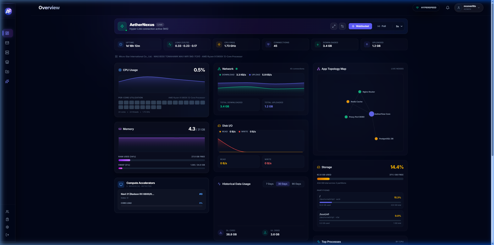<br>**Intelligent Dashboard** | 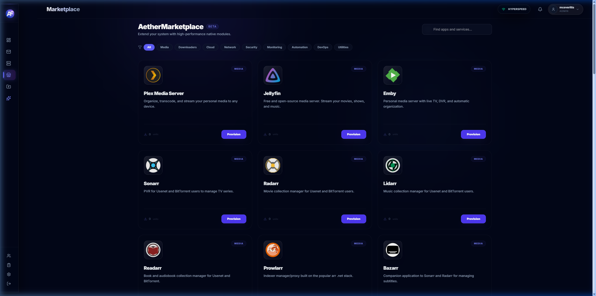<br>**AetherMarketplace** |
| 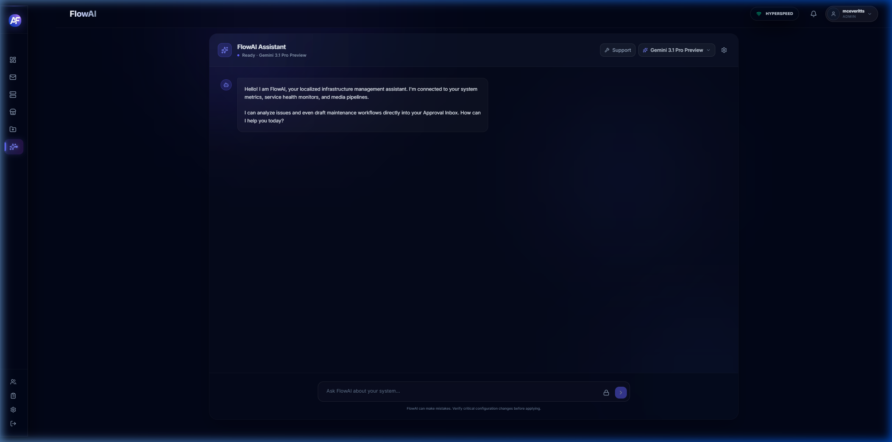<br>**FlowAI Assistant** | 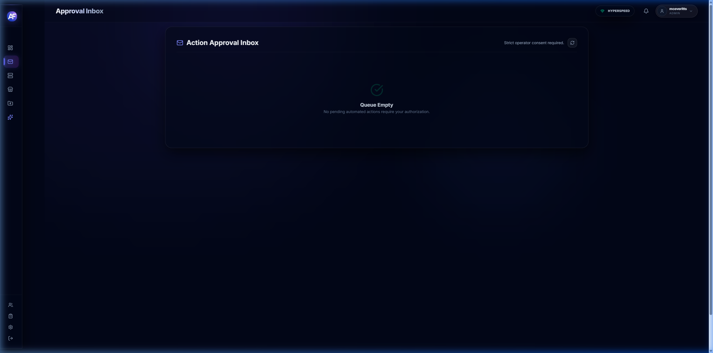<br>**Action Approval Inbox** |
| 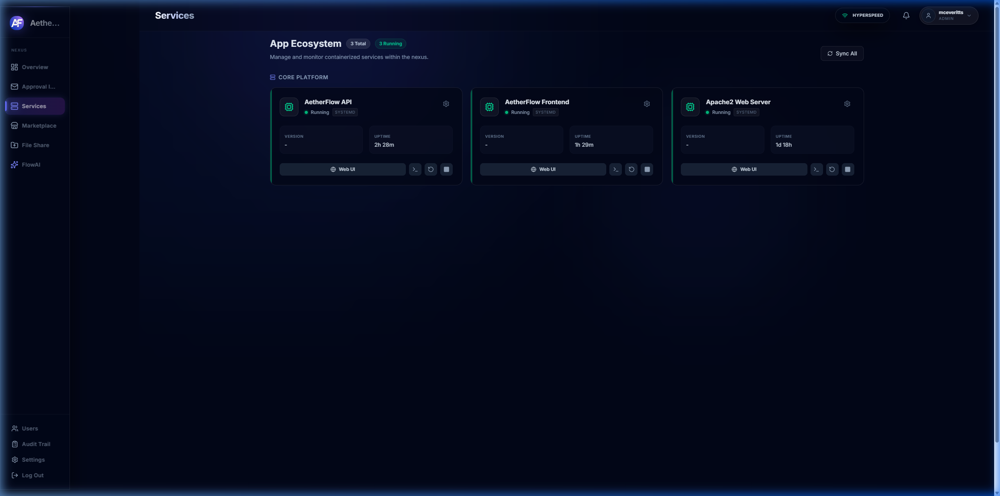<br>**Services Monitor** | 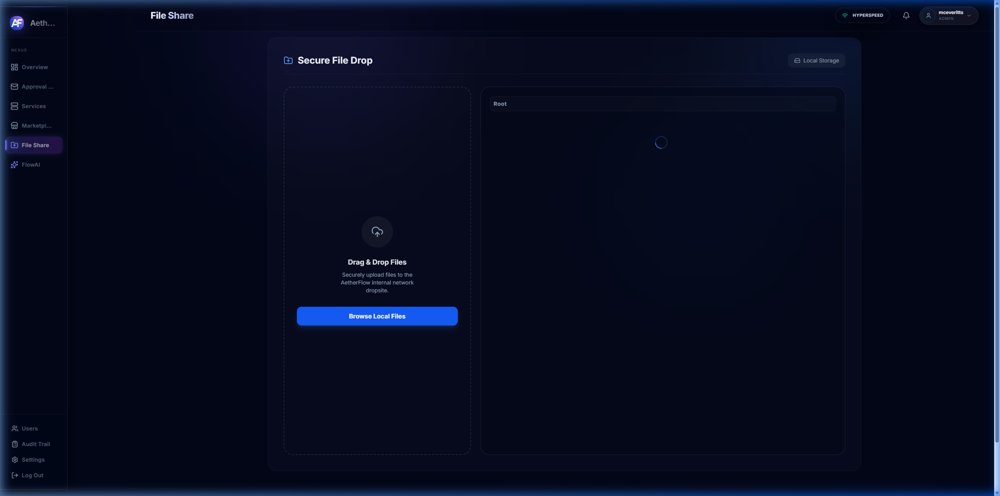<br>**Storage Array** |
| 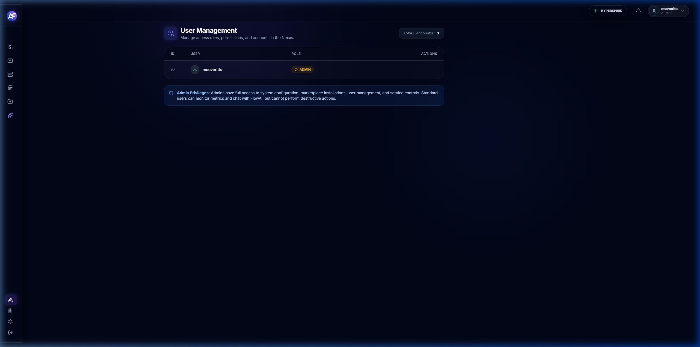<br>**User Management** | 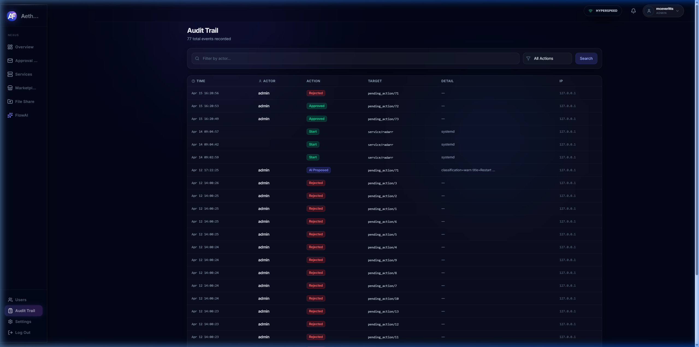<br>**Audit Logs** |
| 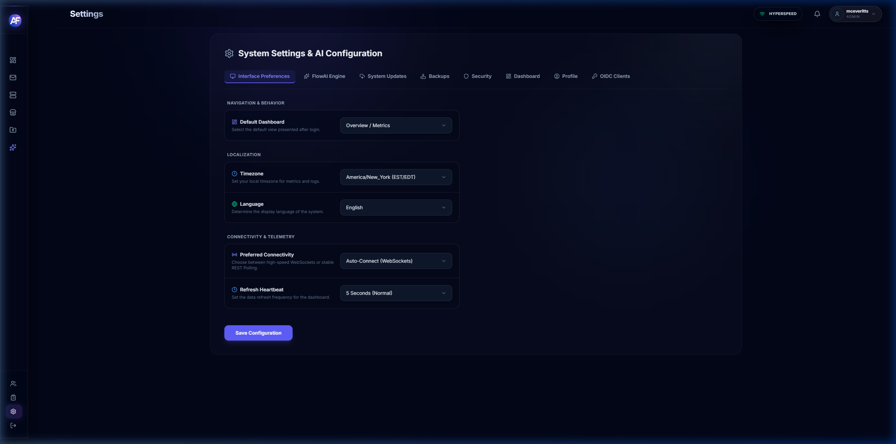<br>**UI Configuration** | 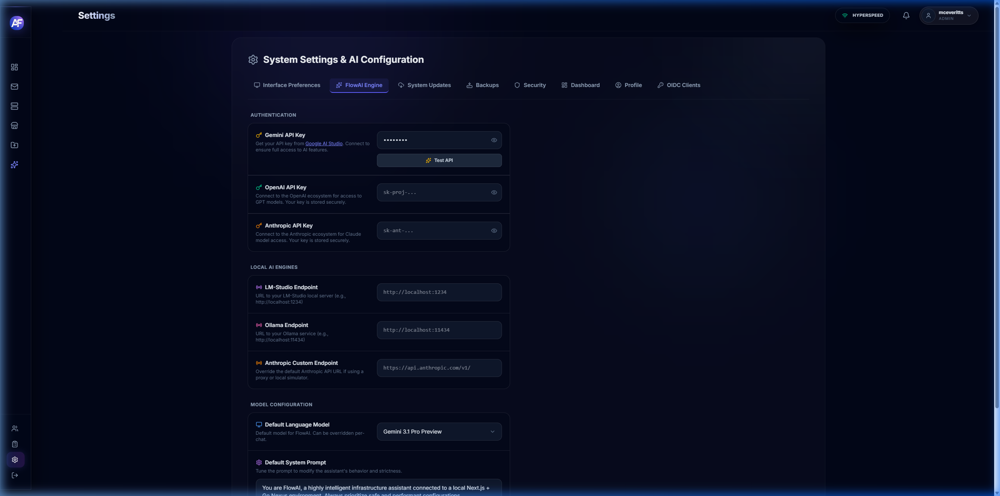<br>**FlowAI Engine Settings** |
| 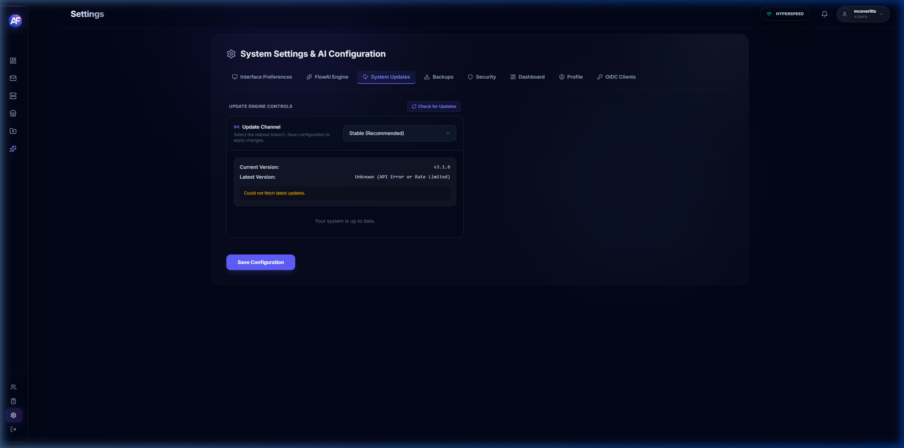<br>**System Updates** |

---

## 🛠️ Quick Installation

For a fresh install on Ubuntu 20.04/22.04 LTS, Debian 11/12, or Kali Linux:

```bash
apt-get update && apt-get -y upgrade
apt-get -y install git
git clone https://github.com/McEveritts/AetherFlow.git /opt/AetherFlow
cd /opt/AetherFlow/setup
sudo bash AetherFlow-Setup
```

Follow the interactive prompts to bootstrap your domain and configure your primary admin credentials. 

## 📄 License

AetherFlow is an open-source project distributed under the MIT License.
