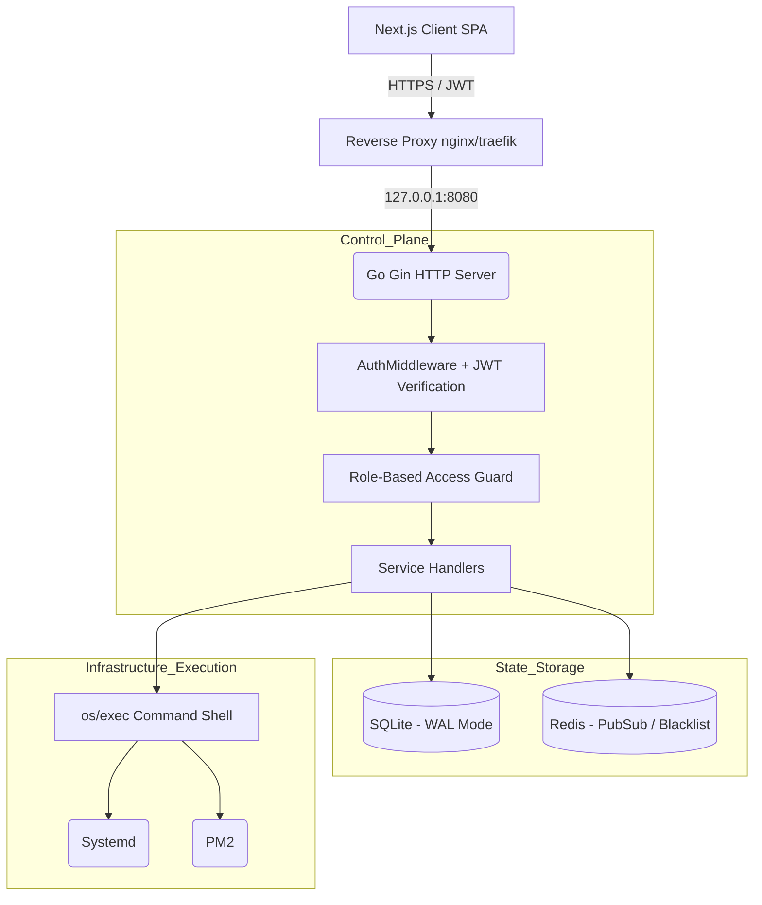

# AetherFlow Codebase Brain

> The definitive architectural and security topology for AetherFlow.

## 1. Core Architectural Axioms

AetherFlow explicitly rejects the complexity of heavy virtualization in favor of direct execution. This platform is governed by three unyielding axioms:

1. **Bare-Metal First**: Applications run on the host OS. Service supervision is managed directly via `systemd` (Linux services) or `PM2` (Node.js/Next.js). We avoid daemon-in-daemon abstractions like nested Docker. Supported platforms officially include **Ubuntu 20.04+**, **Debian 11+**, and **Kali Linux**.
2. **AI-Native, Human-Gated**: Intelligence is useless without authorization constraints. The AI agent analyzes telemetry and formulates `RemediationProposals`. It **CANNOT** mutate system state without cryptographic operator approval via the Global Approval Inbox.
3. **Repository Truth**: Configuration drift is fatal. The source code and database represent the only truth. UI state (`Zustand`) is a direct ephemeral reflection of the Go backend's SQLite footprint.

## 2. Component Topology & Data Flow

When executing an action on AetherFlow, the request traverses the following hard boundaries:

### Constraints:
- **Binding**: The Gin HTTP server binds strictly to loopback (`127.0.0.1`). Any external network access not funneled through the proxy breaks the TLS termination boundary and is blocked.
- **SQLite Concurrency**: By leveraging `PRAGMA journal_mode = WAL;`, AetherFlow supports vast concurrent read throughput. Mutative operations take out exclusive write locks; therefore, heavy computational aggregations must not block standard queries.
- **Observability**: Process, cluster, and OS memory states are continuously exposed via a completely native Prometheus text exposition endpoint at `GET /metrics`. No external exporters are required.

## 3. The Threat & Execution Matrix

AetherFlow's threat model extends `docs/threat_model.md`. The most critical vector is the **AI Escapement Window**.

### Escapement Mitigation
If the AI Support Engine hallucinates a destructive bash sequence (e.g., `rm -rf /`):
1. **Model Distrust**: The LLM output is entirely untrusted. It generates a struct containing proposed operations, not arbitrary commands.
2. **Command Whitelisting**: The Go `os/exec` wrappers exclusively accept strongly-typed enums for safe system calls (e.g., `ACTION_RESTART`, mapped strictly to `systemctl restart %s`).
3. **The Approval Inbox Gap**: The AI's proposed action is serialized and stored in SQLite `pending_actions`. It sits dormant. The action CANNOT execute until an Admin user clicks "Authorize" in the UI, successfully mutating the status to `approved` via `POST /api/v1/actions/:id/approve`. Every resolution is permanently etched into the `admin_audit_log`.

### JWT & Session Lifecycles
Sessions are stateless HTTP-Only cookies with 15-minute expirations.
- Revocation acts via a Redis blacklist mechanism that stores the JTI (`JWT ID`). 
- Fail-open condition: If Redis dies, the system stays online, but revoked sessions may survive until their 15-minute organic expiration.

## 4. Universal Plugin IPC (Inter-Process Communication)

To prevent third-party community plugins from halting the Go control loop:
- Plugins do not compile into the Go binary. They execute as isolated subprocesses alongside the core runtime.
- AetherFlow proxies authorized HTTP and WebSocket requests directly to the plugin's assigned local port using reverse proxy middleware in the Gin router.
- Plugins must specify exact permission scopes (`marketplace:read`, `system:modify`) in their `plugin.manifest.json` before AetherFlow will grant their backend a secure access token.
