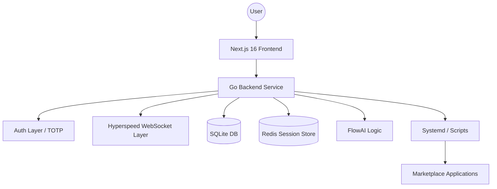

# Architecture

AetherFlow is engineered as a high-concurrency, unified control plane for modern Linux systems. It separates the presentation layer from system orchestration, using **Go** for performance and **systemd** for reliable service management.

## System Overview

---

## Component Breakdown

### 1. Frontend: Next.js 16 (React)
The frontend is a density-aware, immersive dashboard built for speed and responsiveness.
- **State Management**: Uses React hooks and context for near-instant UI updates.
- **Communication**: Hooks into the backend via REST for configuration and **WebSockets (Hyperspeed)** for real-time telemetry.
- **Styling**: Leverages Tailwind 4 for a sleek, modern, glassmorphic aesthetic.

### 2. Backend: Go 1.25 (Gin)
The backend is a compiled binary responsible for all high-privilege operations.
- **Performance**: High-concurrency handling of metrics and service state.
- **Routing**: Strict namespacing (`/api/v1/admin`, `/api/v1/public`) to ensure security.
- **Inter-Process Communication**: Directly manages systemd service units and executes marketplace scripts.

### 3. Orchestration: Systemd
AetherFlow has deprecated PM2 in favor of native Linux `systemd` units.
- **Predictability**: Aligning with the host OS ensures that if the server reboots, AetherFlow and all managed apps recover reliably.
- **Isolation**: Each marketplace application runs as its own systemd service (e.g., `af-plex.service`).
- **Control**: The backend uses `dbus` or direct `systemctl` calls to manage service lifecycles.

### 4. Data Layer: SQLite & Redis
AetherFlow balances simplicity with high-speed invalidation:
- **SQLite**: Stores all persistent state (user accounts, app configurations, marketplace history, security keys).
- **Redis**: Used exclusively for real-time session invalidation (JWT blacklisting) and cross-process coordination in cluster mode.

---

## FlowAI Architecture

FlowAI is integrated at both the API and UI layers to provide context-aware system assistance.

### Context Injection Pipeline
1. **Trigger**: User asks a question in the Support tab.
2. **Analysis**: The backend gathers recent system logs (`journalctl`) and hardware metrics.
3. **Synthesis**: This raw data is injected into the LLM prompt context as a "System Status Digest".
4. **Action Proposal**: If the AI suggests a fix (e.g., "Restarting the network service might help"), it triggers the **Action Gate**.

### The Action Gate Approval Workflow
To prevent destructive autonomous actions, proposals are routed through an internal queue:
- **Proposal**: AI generates a JSON payload for a system action.
- **Intercept**: The Backend scans the payload for protected keywords.
- **Queue**: The action is placed in the **Approval Inbox**.
- **Execution**: Only runs if a human administrator clicks "Approve" in the UI.

---

## Performance: "Hyperspeed" WebSockets

Real-time telemetry is the heartbeat of AetherFlow.
- **Frequency**: Metrics are sampled at sub-second intervals.
- **Efficiency**: Rather than polling, the UI maintains a persistent WebSocket connection.
- **Hardware Awareness**: The backend reads directly from `/proc` and `/sys` to provide overhead-free CPU frequency and per-core temperature tracking.

> [!TIP]
> Architecture decisions are biased toward **Operational Honesty**. The goal is for the dashboard to always reflect the absolute truth of the underlying hardware and service state.
