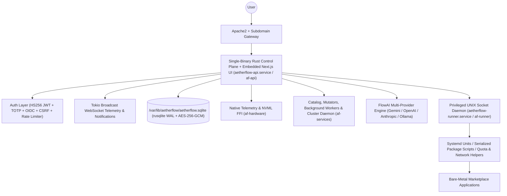

# Architecture

AetherFlow v4.0.0 is engineered as a high-concurrency, single-binary **Rust** control plane (`backend-rs` -> `aetherflow-api`) for bare-metal Linux systems. It embeds the compiled Next.js 16 static UI directly into the Rust binary (`rust-embed` in `af-api`), isolates privileged host operations behind a root-owned UNIX domain socket daemon (`aetherflow-runner.service`, implemented by `af-runner`), and orchestrates bare-metal workloads via **systemd** and **Apache2** with a strict **Zero-Docker mandate**.

## System Overview

```mermaid
graph TD
    User((User)) --> Apache["Apache2 + Subdomain Gateway"]
    Apache --> API["Single-Binary Rust Control Plane + Embedded Next.js UI (aetherflow-api.service / af-api)"]
    API --> Auth["Auth Layer (HS256 JWT + TOTP + OIDC + CSRF + Rate Limiter)"]
    API --> WS["Tokio Broadcast WebSocket Telemetry & Notifications"]
    API --> DB[("/var/lib/aetherflow/aetherflow.sqlite (rusqlite WAL + AES-256-GCM)")]
    API --> HW["Native Telemetry & NVML FFI (af-hardware)"]
    API --> Services["Catalog, Mutators, Background Workers & Cluster Daemon (af-services)"]
    API --> AI["FlowAI Multi-Provider Engine (Gemini / OpenAI / Anthropic / Ollama)"]
    API --> Runner["Privileged UNIX Socket Daemon (aetherflow-runner.service / af-runner)"]
    Runner --> Sys["Systemd Units / Serialized Package Scripts / Quota & Network Helpers"]
    Sys --> Apps["Bare-Metal Marketplace Applications"]
```

---

## Rust Control Plane Workspace (`backend-rs`)

Nine workspace crates compile into `aetherflow-api` (serving the unprivileged HTTP/WebSocket control plane and the `aetherflow-api runner` root socket daemon) and the unified `af` (`af-cli`) administrative CLI binary.

### 1. `af-api` (`backend-rs/crates/af-api`) — HTTP/WS Control Plane & Embedded SPA
- **Zero Production Node.js Runtime**: Next.js 16 compiles to a static export (`NEXT_STATIC_EXPORT=1`) during CI, is staged into `backend/web/dist/`, and is embedded into `aetherflow-api` via `rust-embed` (`backend-rs/crates/af-api/src/embed.rs`).
- **5-Step Static & RSC Resolution**: `serve_spa_request` resolves exact asset paths, `<route>/index.html`, `<route>.html`, and dynamic Next.js route shells (`/marketplace/[id]` -> `/marketplace/__placeholder__/index.html`, plus RSC `.txt` payload fallback) while serving `/_next/static/*` with `Cache-Control: public, max-age=31536000, immutable`.
- **Security, Plugin RBAC & Gateway Middleware**: Enforces HS256 JWT session validation (`aetherflow_session` cookie or `Authorization: Bearer`), plugin-scoped JWT route-scope verification (`plugin_id` + `plugin_scopes`), SQLite-backed token revocation and active session tracking, TOTP 2FA, OIDC/OAuth2 PKCE, state-changing CSRF origin/token checks, per-IP rate limiting, and streaming subdomain & plugin reverse proxying (`Body::from_stream` without full-body RAM buffering).
- **Control Plane Subsystems**: Hosts REST and WebSocket endpoints for Marketplace management, FlowAI multi-provider intelligence (`intelligence.rs`), MediaFlow transcoding/polling, GitHub release update checking (with 5-minute response cache, `X-RateLimit-Reset` / `Retry-After` backoff, `stable`/`nightly`/`experimental` channel filtering, and branch-head SHA fallback), backup archive chunked uploads/restores, multi-node cluster enrollment, and billing webhooks.

### 2. `af-runner` (`backend-rs/crates/af-runner`) — Privileged UNIX Socket Daemon
- **`aetherflow-api.service`**: Runs as unprivileged `User=aetherflow` (`Group=aetherflow`) with systemd sandboxing (`ProtectSystem=strict`, `ProtectHome=yes`, `PrivateTmp=yes`, `NoNewPrivileges=yes`, `RestrictSUIDSGID=yes`, `MemoryMax=512M`).
- **`aetherflow-runner.service`**: Runs `/opt/AetherFlow/current/aetherflow-api runner` in a root cgroup listening on `/run/aetherflow/runner.sock` (`0660 root:aetherflow`).
- **Allowlisted Privileged Verbs**: Exposes `/v1/health`, `/v1/systemctl` (strictly allowlisted unit names and actions), `/v1/package` (15 built-in declarative Rust recipes + legacy Bash fallback serialized under a shared advisory lock), `/v1/package/cancel`, `/v1/self-update` (integrated with `af-release` and `deploy/release-manager.sh`), `/v1/sandbox`, `/v1/hosts`, `/v1/network`, `/v1/quota`, and `/v1/app-meta`.

### 3. `af-db` (`backend-rs/crates/af-db`) — Bundled SQLite WAL & Envelope Encryption
- **Single-Writer SQLite Pool**: Uses `rusqlite` (bundled SQLite) with `r2d2` (`max_size(1)`) in `WAL` mode (`busy_timeout = 5000`, `synchronous = NORMAL`, `foreign_keys = ON`) over `/var/lib/aetherflow/aetherflow.sqlite`.
- **Zero Redis Dependency**: Session tracking, JWT revocation (`revoked_tokens`), OIDC state nonces, and audit logs are persisted directly in SQLite; Redis is disabled in v4.0.0 (`/health/ready` reports `"redis": "disabled"`).
- **Cryptographic Storage**: Encrypts stored secrets and API keys at rest using AES-256-GCM (`enc:v1:<nonce>:<ciphertext>`) derived from `AES_MASTER_KEY`.

### 4. `af-hardware` (`backend-rs/crates/af-hardware`) — Native Telemetry & NVML FFI
- Collects CPU, memory, swap, network, per-mount disk usage, and `/proc/diskstats` I/O counters via `sysinfo` and procfs without spawning shell subprocesses on hot polling paths.
- Dynamically loads `libnvidia-ml.so.1` via `libloading` FFI for zero-fork NVIDIA GPU utilization, VRAM, temperature, and power telemetry.

### 5. `af-services` (`backend-rs/crates/af-services`) — Catalog, Mutators, Plugins & Workers
- **Catalog & Blueprints**: Loads `backend/config/packages.json` (73 apps including Tailscale) and `package_automation.json`, resolves dependency graphs, and checks runtime systemd/process states.
- **Native Config Mutators**: Pure-Rust mutators (`mutators.rs`) for XML (`xml_xpath`), INI (`ini_key`), JSON (`json_key`), SQLite (`sqlite_query`), Pi-hole (`pihole_Config`), and Apache2 domain/TLS virtual hosts (`apache_vhosts`).
- **Native Plugin Runtime (`plugins.rs`)**: Discovers and validates `plugins/*/plugin.manifest.json`, allocates deterministic/dynamic loopback ports (`21000..=21999`), and verifies segment-boundary `api_scopes`.
- **Background Workers & Cluster Daemon**: Runs the periodic metrics recorder, `af-heal` health evaluator, smart backup scheduler (wired to `af-host` for WAL-safe SQLite snapshots + `.manifest.json` + `.sha256`), upstream release watcher, MediaFlow queue poller (`workers.rs`), and multi-node cluster heartbeat daemon (`cluster_daemon.rs`).

### 6. `af-release`, `af-host`, `af-cli` & `af-models`
- **`af-release` (`backend-rs/crates/af-release`)**: Pull-based atomic release engine (`Deploy`, `Rollback`, `Cleanup`, `MigrateSystemd`) with 4-tier SQLite DB path resolution, `stable`/`nightly`/`experimental` channel selection, `/releases/latest` redirect fallback, `prepare_release_permissions`, WAL-safe pre-swap snapshots, and automatic rollback/recovery.
- **`af-host` (`backend-rs/crates/af-host`)**: Shared backup, verification, staged restore (`execute_staged_restore` / `execute_coordinated_restore`), and native system maintenance library (`sentinel_scan_auth_log`, `apply_network_tuning`, `clean_system_logs`, `inspect_home_disk_space`).
- **`af-cli` (`backend-rs/crates/af-cli`)**: Unified `af` administrative CLI binary supporting `package`, `service`, `quota`/`setdisk`, `sandbox`, `release`, `backup`, `maintenance` (`tune`, `sentinel`, `clean-logs`, `showspace`), and `provision` (14 Rust-native foundation steps).
- **`af-models` (`backend-rs/crates/af-models`)**: Shared serde models for catalog entries, hardware metrics, notifications, marketplace payloads, and runner IPC requests/responses.

---

## Strict FHS State & Pull-Based Release Pipeline

- **Immutable Releases**: `/opt/AetherFlow/releases/<timestamp>` symlinked atomically to `/opt/AetherFlow/current`.
- **Mutable State**: `/var/lib/aetherflow/aetherflow.sqlite` (`StateDirectory=aetherflow`, `0700`).
- **Environment Secrets**: `/etc/aetherflow/aetherflow.env` (`0600`).
- **Pull-Based CD**: GitHub Actions (`.github/workflows/release.yml`) and `scripts/build_gold.sh` run Gitleaks, frontend static export (`NEXT_STATIC_EXPORT=1`), `cargo test --workspace`, and `cargo build --release --bin aetherflow-api --bin af`, packaging `aetherflow-linux-<arch>.tar.gz` + `SHA256SUMS`.

See [docs/rust-migration-status.md](rust-migration-status.md) for the complete crate-by-crate and contract-by-contract migration status matrix.
